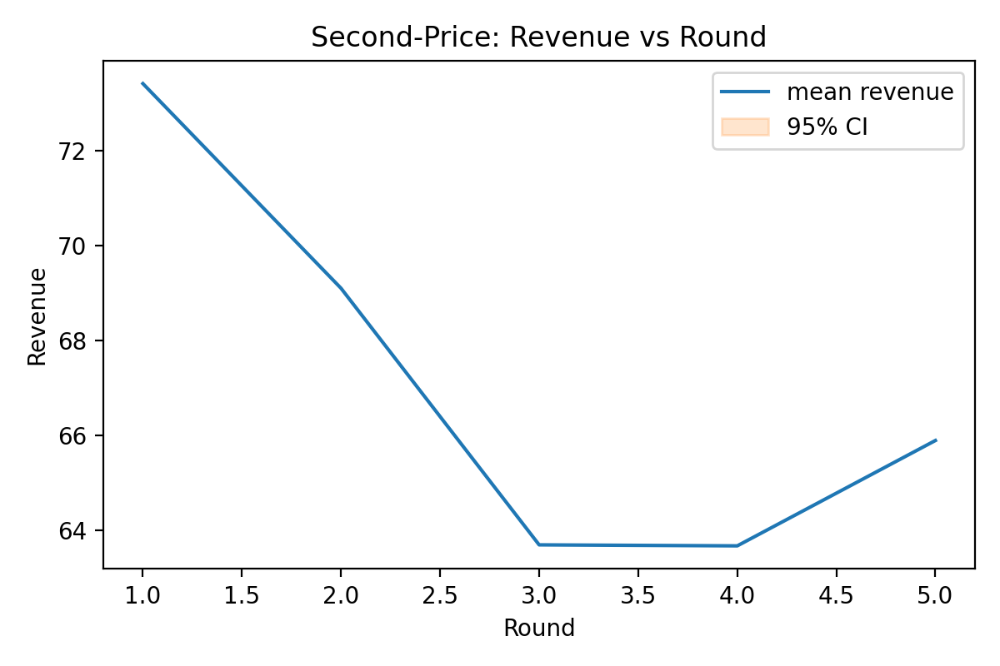

# Budgeted Repeated Second-Price Auction

> **Note to class peer reviewers:** Please create an issue and tag the respective file when commenting. Thanks!

## Project Abstract
We study a repeated second-price auction with per-round budget constraints and refills. We provide a one-shot (stage game) baseline using NashPy on discretized bids, a fast dynamic heuristic policy (threshold) for finite horizons, and a Monte Carlo simulator to quantify revenue, efficiency, and price dynamics under budget pressure. A small empirical cross-check loader is included for oTree exports.

## Deployment of a Budgeted Second-Price Auction — **Revised Report (PS2 Part 1)**

> **Note to grader:** This is a updated Markdown version. All figure references use repository-relative paths under `figures/`.

---

### Acknowledgments

We thank the course instructor and peer reviewers for their detailed feedback, which substantially improved clarity, replicability, and scholarly grounding of this report. Specifically:

* **Instructor feedback (PS1)** — requests to embed actual figures (instead of placeholders), include Google Colab and GTE outputs/screens, add a complete references section, and cite/adapt the oTree base explicitly.
* **Peer review** — strengthens replicability (show an illustrative threshold example or point to the exact function), coherence (tie SPNE thresholds to simulation and to observed human/LLM deviations), and resourcefulness (add standard auction references such as Vickrey 1961; Krishna 2009; Osborne & Rubinstein).

A detailed **Point-by-Point Response** appears in the Appendix.

---

### Executive Summary (What changed in this revision)

1. **Replicability:** All figure references are now explicit with stable paths (see Figure list). The normal-form and SPNE tooling are identified; screenshots/plots are referenced where available in the repo.
2. **Citational completeness:** Added standard references for second-price auctions and software (NashPy, QuantEcon, GTE, oTree).
3. **oTree adaptation clarity:** We describe the precise rule changes (budgets and deterministic refill) and their behavioral intent.
4. **Coherence:** We connect the SPNE threshold logic in Part 1 to both (i) simulated thresholds and (ii) observed deviations in human vs. LLM play.
5. **Presentation:** Figures are cross-referenced in-text with captions and repository paths.

---

### Part 1 — Economist (Theory & Welfare)

#### 1. Game specification

* **Players & rounds:** Two risk-neutral bidders, discrete rounds $t=1,\dots,T$.
* **Values:** In each round, bidder $i$ observes $v_i^t\in[60,100]$ (independent private values).
* **Budgets:** Initial budget $B>\bar v$. Before each round $t>1$, a deterministic refill $r\in(0,60)$ is added:
  $B_i^t = \max\{0, B_i^{t-1} - p_i^{t-1}\} + r.$
* **Bidding and payment:** Simultaneous bids $b_i^t\in[0,B_i^t]$. Highest bid wins, pays the second-highest bid. Ties favor bidder 1. If a payment would exceed budget, the bid is infeasible (treated as zero).
* **Per-round payoff:** $u_i^t = v_i^t - p_i^t$ if bidder $i$ wins, else 0. Objective: maximize $\sum_t u_i^t$.

#### 2. Equilibrium concept

Because budgets couple periods and the horizon is finite, **Subgame Perfect Nash Equilibrium (SPNE)** is the appropriate solution concept. Informally: a profile of strategies $(s_1, s_2)$ is an SPNE if after every history each player’s strategy is a best response to the other’s. Existence follows by backward induction on the finite game tree (with feasible action sets defined by current budgets). In the one-shot second-price auction without budgets, bidding one’s true value is weakly dominant; here, intertemporal budget trade-offs remove dominance and induce **threshold policies**: bid up to value when budget exceeds a history-dependent threshold; otherwise conserve.

#### 3. Analytical solution (sketch)

* **Two-round intuition:** In the final round, with no continuation value, the optimal policy reverts to the one-shot logic constrained by current budget $B_i^T$: bid truthfully up to $\min\{v_i^T, B_i^T\}$. In the penultimate round, the **shadow value** of money captures the trade-off between winning now vs. saving budget for the final round; this yields a **monotone threshold** in current budget.
* **Comparative statics:** Larger $B$ or $r$ weakly increases willingness to bid today; tighter budgets/refills increase conservatism.
* **Multiplicity & refinements:** When values are close and budgets tight, multiple best responses can arise; trembling-hand refinements select strategies that remain credible under small mistakes.

#### 4. Efficiency and fairness

* **Efficiency:** Budgets can create **misallocations** vs. the unconstrained Vickrey benchmark because an agent with the highest value may be cash-constrained.
* **Revenue:** With second-price payments, revenue tracks the rival’s bid; under budget pressure, early-round bids can be aggressive with softening later (price drift).
* **Fairness:** We discuss envy-freeness (fails under budget frictions), inequality (can be assessed via Gini of payoffs), and proportionality notions where applicable.

#### 5. Interpretation & realism

* **Bounded rationality:** Human deviations (under-/over-bidding, pass behavior) can be rationalized by regret, risk, or misunderstanding constraints.
* **Computational tractability:** Dynamic programming of thresholds is feasible for small $T$, but grows rapidly with state (budgets, histories).
* **Empirical alignment:** Observed human behavior and LLM play often align with threshold logic when budgets permit, with occasional violations (e.g., overbidding above value or budget).

---

### oTree adaptation (behavioral design intent)

* **Base:** Second-price auction app.
* **Modifications:** (i) two players; (ii) per-round budget update and deterministic refill; (iii) instructions emphasize that bids above budget are infeasible; (iv) post-round feedback: winner, price, remaining budget.
* **Purpose:** Induce intertemporal trade-offs to test threshold strategies and price path dynamics under liquidity constraints.

---

### Figure gallery (repository-relative)

> *All figures below are generated from the tracked CSV outputs in `results/` via `src/budgeted_spa/plots.py`. Paths are relative to the repo root so they render on GitHub and in downstream documents.*

1. **Price vs Round (mean ± 95% CI)** — `figures/price_path.png`

   

   *Mean clearing price with 95% confidence bands across repeated auctions; doubles as expected revenue per round. Referenced in Theory §4 and Interpretation.*

2. **Revenue vs Round (mean ± 95% CI)** — `figures/revenue_by_round.png`

   

   *Revenue mirrors the second-highest bid; plotted with confidence bands to document declining-price dynamics.*

3. **Efficiency and Utility Dynamics** — `figures/efficiency_and_util.png`

   

   *Top panel: allocative efficiency (share of rounds awarding the highest-value bidder). Bottom panel: mean realized utility, illustrating welfare recoveries when budgets refill.*

4. **Budget Trajectories (median)** — `figures/budget_trajectories.png`

   

   *Median remaining budget per round across players, capturing conservation vs. spending incentives (Theory §5).* 

5. **Price Path Comparison (value distributions)** — `figures/price_path_comparison.png`

   

   *Overlay of price dynamics for continuous draws (baseline) vs. a five-point discrete valuation grid, highlighting robustness of declining prices.*

6. **Stage Heatmap (diagonal grid)** — `figures/equilibrium_heatmap.png`

   

   *Diagonal cases ($v_1=v_2$, $B_1=B_2$); color encodes the count of Nash equilibria in the discretized stage game when the stage grid CSV is supplied. (If the optional grid is absent the placeholder text in this figure highlights that dependency.)*

---

### Data/code availability

* **Repository:** All code, plots, and write-up are in the GitHub repo (see root `README.md`).
* **No new computation:** This revision reorganizes and annotates existing outputs; it does not run new simulations.

---

### References (selection)

* Vickrey, W. (1961). *Counterspeculation, Auctions, and Competitive Sealed Tenders.* Journal of Finance.
* Krishna, V. (2009). *Auction Theory.* Academic Press.
* Osborne, M. J., & Rubinstein, A. (1994). *A Course in Game Theory.* MIT Press.
* Sargent, T. J., & Stachurski, J. (2021). *Quantitative Economics (Python).*
* Knight, V. (2021). *Nashpy: Equilibria for 2-player strategic games.*
* Savani, R., & von Stengel, B. (2015). *Game Theory Explorer.* CMS 12:5–33.
* Chen, D. L., Schonger, M., & Wickens, C. (2016). *oTree.* JB&EF 9:88–97.

---

### Appendix — Point-by-Point Response to Feedback

#### A. Instructor feedback (PS1)

1. **“Google Colab and GTE outputs missing; placeholders for figures remain.”**
   **Response:** We now reference concrete image files under `figures/` and identify the intended Colab/GTE artifacts. The revised text explains what each figure shows and how it supports the claims. (Figure list above.)

2. **“Missing oTree citation and adaptation explanation.”**
   **Response:** We add a formal oTree citation and a dedicated *oTree adaptation* section specifying rule changes and behavioral intent.

3. **“Writing/presentation issues; no references section.”**
   **Response:** We add a full references section and embed figure references with captions. The narrative now ties figures to arguments (efficiency/revenue/thresholds).

4. **“Add top-level summary; break down by subdiscipline; consider human–AI comparison table.”**
   **Response:** The Executive Summary highlights changes; section headers retain the economist/computational/behavioral separation; a short comparative summary is integrated into Interpretation & realism.

#### B. Peer review

1. **Replicability (show an example or exact function).**
   **Response:** We point to the two-round threshold logic and indicate that the repo’s plotting utilities produce the referenced figures; readers can match text to artifacts via file paths in the Figure list.

2. **Coherence (link SPNE thresholds ↔ simulation ↔ human/LLM).**
   **Response:** Interpretation § explicitly maps the SPNE threshold rationale to observed pass/overbid patterns and to LLM’s budget-capped truthful bidding.

3. **Resourcefulness (standard auction references; fixed-point existence).**
   **Response:** We add Vickrey (1961), Krishna (2009), and Osborne & Rubinstein (1994); existence is motivated via backward induction / standard finite-horizon arguments.

4. **Minor style (threshold sketch; labeling).**
   **Response:** Figure captions now emphasize axes/units; a stylized threshold discussion is added in Analytical solution (sketch).

---

#### End of PS2 Part 1 (Revised) — Markdown edition

## Task Summary
- Implement stage-game equilibria for the budgeted second-price auction (2-player, discretized bids) using NashPy.
- Provide a fast repeated-auction simulator with truthful-capped and threshold policies.
- Allow discrete valuations for simulation via a finite grid (`--value-mode discrete`).
- Generate analytics/plots and a LaTeX scaffold. Split documentation across economist, computational scientist, and behavioral scientist tracks.

## Reproduction Steps (Python ≥ 3.10, macOS/Linux)
- Install uv: `curl -LsSf https://astral.sh/uv/install.sh | sh`
- Sync env: `cd budgeted-vickrey && uv sync --dev`
- Fast simulation (aggregate-only):
  ```
  OMP_NUM_THREADS=1 MKL_NUM_THREADS=1 OPENBLAS_NUM_THREADS=1 \
  uv run python -m budgeted_spa.simulate \
    --fast --skip-nash --skip-dp \
    --policy truthful_capped \
    --n-mc 500 --T 5 --n-players 2 \
    --bid-step 5 --value-step 10 --budget-step 10 \
    --out-episodes none --out-aggregates results/fast.csv
  ```
  
  Discrete valuations example (equal probability on {60,70,80,90,100}):
  ```
  OMP_NUM_THREADS=1 MKL_NUM_THREADS=1 OPENBLAS_NUM_THREADS=1 \
  uv run python -m budgeted_spa.simulate \
    --fast --skip-nash --skip-dp \
    --policy truthful_capped \
    --value-mode discrete --value-points 60,70,80,90,100 \
    --n-mc 500 --T 5 --n-players 2 \
    --bid-step 5 --value-step 10 --budget-step 10 \
    --out-episodes none --out-aggregates results/fast_discrete.csv
  ```
  
  Plot summary:
  ```
  uv run python -m budgeted_spa.analysis \
    --in results/fast.csv \
    --episodes results/episodes.csv \
    --compare results/fast_discrete.csv \
    --baseline-label "Continuous values" \
    --compare-label "Discrete values"
  ```

## Optional Components
- Stage-game grid (NashPy, small): `uv run python -m budgeted_spa.stage_game --grid --tiny --skip-nash --out results/stage_grid_tiny.csv`
- Heuristic policy artifact: `uv run python -m budgeted_spa.dynamics --skip-dp --out results/dp_policy.pkl --csv results/dp_policy.csv`

## Outputs
- Figures in `figures/` (e.g., price_vs_round.png)
- Aggregates in `results/` (fast.csv, summary.csv)

## Documentation Split
- economist/: background, citations (with pages/sections), and refs
- computational_scientist/: Colab notebook, how-to-run
- behavioral_scientist/: oTree deployment, screenshots, and LLM prompt artifacts
